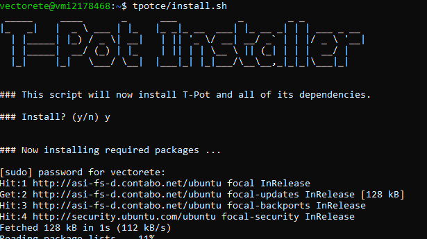

# Introduction
To protect my network and prevent lateral movement, I will utilise a cloud virtual machine (VM) from Contabo. Contabo will offer me a reliable and secure machine for this experiment, situated in a separate network. Also, it is not that restricted as other VPS to receive all the suspicious traffic it generates.

## Firewall Configuration
### External - Azure Firewall (example)
Before heading with the installation, to minimise the risk of someone entering in our system or accessing the log management website, in Azure firewall or whatever you will be using, allow only access to ssh or to the website log management to your own IP with the one you will be accessing these resources.
In Azure Firewall - Settings -> Networking - Inbount Port Ruless
- Rule for Web access for log management:
	* Source: Ip Adresses
	* Source: <YOUR-IP>
	* Source port ranges: *
	* Destination: Any
	* Service: Custom
	* Destination port ranges: 64297
	* Protocol: TCP
	* Action: Allow
	* Priority(any, preferably a lower number): 101
	* Name(any descriptive name, as you prefer): tpot-mylogman
- Rule for SSH:
	* Source: Ip Adresses
	* Source: <YOUR-IP>
	* Source port ranges: *
	* Destination: Any
	* Service: Custom
	* Destination port ranges: 64295
	* Protocol: TCP
	* Action: Allow
	* Priority(any, preferably a lower number): 102
	* Name(any descriptive name, as you prefer): tpot-myssh
- Rule to allow the rest of the ports:
	* Source: Ip Adresses
	* Source: Any
	* Source port ranges: 0-64293, 64296, 64298-65535
	* Destination: Any
	* Service: Custom
	* Destination port ranges: Any
	* Protocol: Any
	* Action: Allow
	* Priority(any, preferably a lower number): 103
	* Name(any descriptive name, as you prefer): tpot-allowports
- Rule to deny the rest of the rules:
	* Source: Ip Adresses
	* Source: Any
	* Source port ranges: Any
	* Destination: Any
	* Service: Custom
	* Destination port ranges: Any
	* Protocol: Any
	* Action: Allow
	* Priority(A big number to be processed as the last rule): 65500
	* Name(any descriptive name, as you prefer): tpot-denycon

### Internal - IPTABLES
With IPTABLES, you have to first install iptables-persistent to make the changes persist:
```bash
apt-get install iptables-persistent
```

- Rule for Web access for log management:
```bash
iptables -A INPUT -p tcp --dport 64297 -s <YOUR-IP> -j ACCEPT
```

- Rule for accessing SSH as before after the installation:
```bash
iptables -A INPUT -p tcp --dport 64295 -s <YOUR-IP> -j ACCEPT
```

> [!IMPORTANT]
> To continue accessing remotely, replace <YOUR-IP> with your home network's IP.

- Rule to allow the rest of the ports:
```bash
iptables -A INPUT -p tcp -m multiport --dports 0:64293,64296,64298:65535 -j ACCEPT
iptables -A INPUT -p udp -m multiport --dports 0:64293,64296,64298:65535 -j ACCEPT
iptables -A INPUT -p icmp -j ACCEPT
```

- Rule to deny the rest of the rules:
```bash
iptables -A INPUT -j DROP
```

> [!NOTE]
> Instead of changing the IPTABLES input policy, add this rule, as T-POT will add rules to accept any incoming traffic.

And we will make the rules persistent with:
```bash
iptables-save > /etc/iptables/rules.v4
```

## Installation
### Configuring non-root user

I don't have a non-root user, which is required for the installation, so I will create one:
```bash
adduser <username>
```

Add it to the sudoers file:
```bash
usermod -aG sudo <username>
```

Change to the new user:
```bash
su - <username>
```

> [!NOTE]
> Replace <username> with your desired username.

### Installing T-POT

<div align="center">
  <a href="https://github.com/vectorete/honeynet-vs-deception_technologies/blob/main/GUIDE.md">
    
  </a>
</div>

We will start first updating and upgrading the system:
```bash
sudo apt update && sudo apt upgrade -y
```

Install git to be able to clone the t-pot repository:
```bash
sudo apt install git
```

Clone the repository with git:
```bash
git clone https://github.com/telekom-security/tpotce.git
```

Modify the configuration so that the web administration uses a specific username and password:
```bash
nano tpotce/iso/installer/tpot.conf
```
```
# tpot configuration file
# myCONF_TPOT_FLAVOR=[STANDARD, SENSOR, INDUSTRIAL, COLLECTOR, NEXTGEN]
myCONF_TPOT_FLAVOR='STANDARD'
myCONF_WEB_USER='<DESIRED-WEB-USER>'
myCONF_WEB_PW='<DESIRED-WEB-PASSWORD>'
```

Run the installer:
```bash
tpotce/install.sh
```

<div align="center">
  <a href="https://github.com/vectorete/honeynet-vs-deception_technologies/blob/main/GUIDE.md">
    
  </a>
</div>

> [!WARNING]
> If you have problems, check if your operating system is compatible. You may need to upgrade your distribution or change operating systems.

Choose the Hive installation mode, which is the standard mode:

<div align="center">
  <a href="https://github.com/vectorete/honeynet-vs-deception_technologies/blob/main/GUIDE.md">
    
  </a>
</div>

Introduce your desired web name and the desired password for log web managament with Kibana.

<div align="center">
  <a href="https://github.com/vectorete/honeynet-vs-deception_technologies/blob/main/GUIDE.md">
    
  </a>
</div>

Reboot to machine to run t-pot:
```bash
sudo reboot
```

### Accessing the web management and the console 
Now to connect to your cloud VM you will need the port 64295:
```bash
ssh <username>@<YOUR-VM-CLOUD-IP> -p 64295
```

> [!IMPORTANT]
> Any other port will be the honeypot ssh service.

Now you can enter to `https://<YOUR-VM-CLOUD-IP>:64297` from your home network to see all the different logs compilated on different graphs.

You can set the range datatime for the logs:
<div align="center">
  <a href="https://github.com/vectorete/honeynet-vs-deception_technologies/blob/main/GUIDE.md">
    
  </a>
</div>
