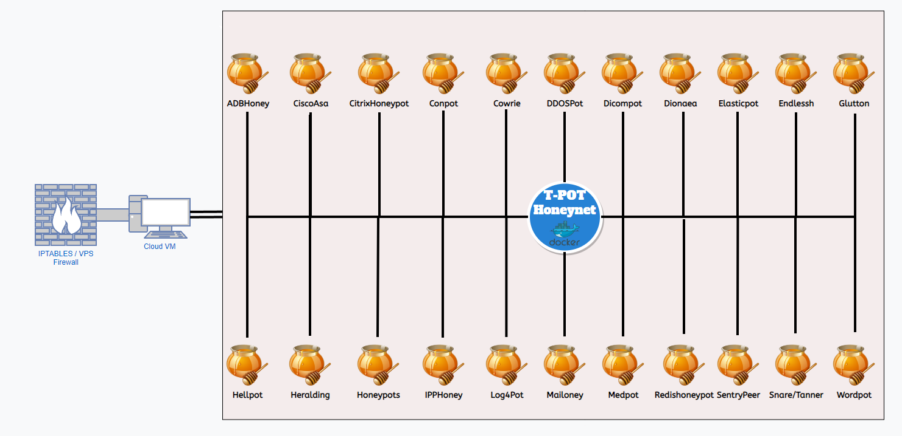

<a id="readme-top"></a>

<!-- PROJECT SHIELDS -->
[![Contributors][contributors-shield]][contributors-url]
[![Forks][forks-shield]][forks-url]
[![Stargazers][stars-shield]][stars-url]
[![Issues][issues-shield]][issues-url]
[![MIT License][license-shield]][license-url]
[![LinkedIn][linkedin-shield]][linkedin-url]

<!-- PROJECT LOGO -->
<br />
<div align="center">
  <a href="https://github.com/vectorete/honeynet-vs-deception_technologies">
    
  </a>
  <h3 align="center">Honeynet comparative against Deception Technology</h3>

  <p align="center">
    This project aims to set-up a Honeynet, analyse the segreggated data by each honeypot, in order to seek a general attack pattern, describing the limitations and features provided in comparison to a deception technology.
    <br />
    <a href="https://github.com/vectorete/honeynet-vs-deception_technologies"><strong>Explore the docs »</strong></a>
    <br />
    <br />
    <a href="https://github.com/vectorete/honeynet-vs-deception_technologies">View Demo</a>
    ·
    <a href="https://github.com/vectorete/honeynet-vs-deception_technologies/issues/new?labels=bug&template=bug-report---.md">Report Bug</a>
    ·
    <a href="https://github.com/vectorete/honeynet-vs-deception_technologies/issues/new?labels=enhancement&template=feature-request---.md">Request Feature</a>
  </p>
</div>

<!-- TABLE OF CONTENTS -->
<details>
  <summary>Table of Contents</summary>
  <ol>
    <li>
      <a href="#about-the-project">🔎 About The Project</a>
      <ul>
        <li><a href="#objectives">🎯 Objectives</a></li>
        <li><a href="#features">✨ Features</a></li>
        <li><a href="#topology">🖧 T-POT Topology - Host Environment</a></li>
      </ul>
    </li>
    <li>
      <a href="#getting-started">🚀 Getting Started</a>
      <ul>
        <li><a href="#prerequisites">📝 Prerequisites</a></li>
        <li><a href="#installation">📥 Installation</a></li>
        <li><a href="#config-note">📁 Configuration Note</a></li>
      </ul>
    </li>
    <li>
      <a href="#honeynet-deceptiontech">🆚 Honeynet vs Deception Technology</a>
      <ul>
        <li>
          <a href="#honeynet">🍯 Honeynet</a>
          <ul>
            <li><a href="#live">🔴 Live Attack Map</a></li>
            <li><a href="#honeynet-analysis">📊 Analysis</a></li>
            <ul>
              <li><a href="#honeynet-summary">📝 Honeynet summary - T-POT</a></li>
              <li><a href="#honeypot-adbhoney">🐝 Honeypot - ADBHoney</a></li>
              <li><a href="#honeypot-adbhoney">🐝 Honeypot - ADBHoney</a></li>
              <li><a href="#honeypot-ciscoasa">🐝 Honeypot - CiscoASA</a></li>
              <li><a href="#honeypot-conpot">🐝 Honeypot - Conpot</a></li>
              <li><a href="#honeypot-cowrie">🐝 Honeypot - Cowrie</a></li>
              <li><a href="#honeypot-ddospot">🐝 Honeypot - DDOSPot</a></li>
              <li><a href="#honeypot-dionaea">🐝 Honeypot - Dionaea</a></li>
              <li><a href="#honeypot-elasticpot">🐝 Honeypot - ElasticPot</a></li>
              <li><a href="#honeypot-heralding">🐝 Honeypot - Heralding</a></li>
              <li><a href="#honeypot-redishoneypot">🐝 Honeypot - RedisHoneyPot</a></li>
              <li><a href="#honeypot-sentrypeer">🐝 Honeypot - SentryPeer</a></li>
            </ul>
          </ul>
        </li>
        <li>
          <a href="#deceptiontech">🤥 Deception Technology</a>
          <ul>
            <li><a href="#competitors">🏆 Competitors</a></li>
          </ul>
        </li>
        <li><a href="#comparison">📁 Comparison</a></li>
      </ul>
    </li>
    <li><a href="#resources">📚 Resources</a></li>
    <li><a href="#contributing">🤝 Contributing</a></li>
    <li><a href="#license">©️ License</a></li>
    <li><a href="#contact">☎️ Contact</a></li>
  </ol>
</details>

<!-- ABOUT THE PROJECT -->
## 🔎 About The Project <a id="about-the-project"></a>
<div align="center">
  <a href="https://github.com/vectorete/honeynet-vs-deception_technologies">
    
  </a>
</div>
  <p align="justify">
  The project started with the goal of meticulously evaluating the effectiveness of the data-gathering capabilities on a Honeynet, using T-POT; the well-known Honeynet project developed by Deutsche Telekom, which provided this remarkable solution to the open-source community in a user-friendly format that anyone can deploy. The aim is to compare with the new evolving technologies, known as Deception Technologies, available to larger companies.
  </p>
<p align="right">(<a href="#readme-top">back to top</a>)</p>

### 🎯 Objectives <a id="objectives"></a>
- **Setting up a Honeynet:** Set up the Honeynet, T-POT, which adotps a unique cluster containing multiple recognised honeypots, both low and high interaction.
- **Analyse the segregated data by the Honeynet:** Analyse the data retrieved from the different honeypots with the ELK stack implementation for log management, providing valuable graphs that can be configured.
- **Correlate the data to identify attack patterns:** View the most common brute-force credentials, attack exploit attempts (CVE), port scan attempts...
- **Establishing the Honeynet limitations to contrast the Deception Technology advancements:** Extract the limitations of the Honeynet methodology and compare it to the improvements and evolution of deception technology.

<p align="right">(<a href="#readme-top">back to top</a>)</p>

### ✨ Features <a id="features"></a>
1. **Secure Isolated Environment**:
Configured a Cloud Virtual Machine in a remote network to secure my own network by avoiding lateral movement to my personal machines.

2. **Practical Configuration Guide**:
Concise and practical configuration of the cloud machine, which can serve as a handy reference with other VPS providers and for the Honeynet T-POT installation.

3. **Secure Firewall Set Up**:
External firewall configuration, with Azure networking, and internal firewall configuration, with IPTABLES, to grant access only to authorised users for SSH and web ELK stack log management.

4. **Pattern detection of attacks**:
Analysed the retrieved logs after a few days of running different vulnerable services, on the different honeypots exposed to the Internet.

5. **Honeynet and Deception Technology Comparison**:
Side-by-side comparison of both technologies, showcasing their advantages and disadvantages.

<p align="right">(<a href="#readme-top">back to top</a>)</p>

### 🖧 T-POT Topology - Host Environment <a id="topology"></a>
<div align="center">
  <a href="https://github.com/vectorete/honeynet-vs-deception_technologies">
    
  </a>
</div>

#### Virtualization
The T-Pot honeynet operates within Docker containers, using Docker Compose to execute each honeypot in its own container, ensuring isolation in order to not affect the proper functionality of the others.

NGINX is used as a reverse proxy to route traffic to the appropriate honeypot containers based on the incoming request type and port.

<p align="right">(<a href="#readme-top">back to top</a>)</p>

#### Honeypots
Each honeypot runs on separate Docker containers with specific inbound ports exposed to the Internet, capturing and analysing malicious traffic. The honeypots and port mappings are as follows:

| **Honeypot**          | **Ports**          | **Description**     |
|-----------------------|--------------------|---------------------|
| [ADBhoney](https://github.com/huuck/ADBHoney) | 5555/tcp | Low interaction honeypot designed for Android Debug Bridge over TCP/IP |
| [CiscoASA](https://github.com/Cymmetria/ciscoasa_honeypot)| 5000/udp, 8443/tcp | Low interaction honeypot for the Cisco ASA component, detects CVE-2018-0101 DoS and remote code execution. |
| [CitrixHoneypot](https://github.com/MalwareTech/CitrixHoneypot) | 443/tcp | Simulates the behaviour of a Citrix NetScaler device, detecting and logging CVE-2019-19781 attempts. |
| [Conpot](https://github.com/mushorg/conpot) | 80/tcp, 102/tcp, 502/tcp, 1025/tcp, 2404/tcp, 10001/tcp, 44818/tcp, 47808/tcp, 50100/tcp, 161/udp, 623/udp | ICS/SCADA honeypot that simulates industrial control systems. |
| [Cowrie](https://github.com/cowrie/cowrie) | 22/tcp, 23/tcp | Medium-interaction honeypot that emulates SSH and Telnet, captures and logs attempted attacks. |
| [DDOSPot](https://github.com/aelth/ddospot) | 19/udp, 53/udp, 123/udp, 1900/udp | Honeypot for tracking and monitoring UDP-based Distributed Denial of Service (DDoS) attacks. |
| [Dicompot](https://github.com/nsmfoo/dicompot) | 11112/tcp | Combination of Dionaea and Conpot honeypots. |
| [Dionaea](https://github.com/DinoTools/dionaea) | 21/tcp, 42/tcp, 445/tcp, 3306/tcp | High-interaction honeypot capturing malware samples and common exploits on SMB, HTTP, and FTP services. |
| [Elasticpot](https://gitlab.com/bontchev/elasticpot) | 9200/tcp | Honeypot simulating a vulnerable Elasticsearch server.  |
| [Endlessh](https://github.com/skeeto/endlessh) | 22/tcp | SSH tarpit honeypot designed to slow down and frustrate SSH brute-force attacks. |
| [Glutton](https://github.com/mushorg/glutton) | */tcp, */udp | Low interaction honeypot capable of receiving any network traffic by accepting connections on any port. |
| [Hellpot](https://github.com/yunginnanet/HellPot) | 80/tcp | Honeypot designed to crash bots and clients that visit its location. |
| [Heralding](https://github.com/johnnykv/heralding) | 21/tcp, 22/tcp, 25/tcp, 110/tcp | Credentials capturing low interaction honeypot.                                                                           |
| [Honeypots](https://github.com/qeeqbox/honeypots) | 21/tcp, 22/tcp, 23/tcp, 25/tcp, 80/tcp, 110/tcp, 143/tcp, 389/tcp, 443/tcp, 445/tcp, 631/tcp, 1080/tcp, 1433/tcp, 1521/tcp, 3306/tcp, 3389/tcp, 5060/tcp, 5432/tcp, 5900/tcp, 6379/tcp, 6667/tcp, 8080/tcp, 9100/tcp, 9200/tcp, 11211/tcp, 53/udp, 123/udp, 161/udp, 5060/udp | Thirty honeypots in a single package for monitoring network traffic, bots, and credential attempts. |
| [IPPHoney](https://gitlab.com/bontchev/ipphoney) | 631/tcp | Low interaction honeypot emulating Internet Printing Protocol (IPP) printers. |
| [Log4Pot](https://github.com/thomaspatzke/Log4Pot) | 80/tcp, 443/tcp, 8080/tcp, 9200/tcp, 25565/tcp | Honeypot for the Log4Shell vulnerability (CVE-2021-44228). |
| [Mailoney](https://github.com/awhitehatter/mailoney) | 25/tcp | SMTP honeypot, Open Relay, credential harvester. |
| [MedPot](https://github.com/schmalle/medpot) | 2575/tcp | HL7 / FHIR honeypot. |
| [RedisHoneyPot](https://github.com/cypwnpwnsocute/RedisHoneyPot) | 6379/tcp | High Interaction Honeypot for Redis protocol. |
| [SentryPeer](https://github.com/SentryPeer/SentryPeer) | 5060/tcp, 5060/udp | Fraud detection honeypot that logs VoIP attack attempts. |
| [Snare](https://github.com/mushorg/snare)/[Tanner](https://github.com/mushorg/tanner) | 80/tcp | SNARE (Super Next Generation Advanced Reactive honeypot) and Tanner evaluates SNARE events. |
| [WordPot](https://github.com/gbrindisi/wordpot) | 8090/tcp | WordPress honeypot. |

<p align="right">(<a href="#readme-top">back to top</a>)</p>

##### Honeypot Tools
| **Tool**  | **Description**                                                                                                         |
|-----------|-------------------------------------------------------------------------------------------------------------------------|
| [Honeytrap](https://github.com/armedpot/honeytrap/) | Network security tool written to observe attacks against TCP or UDP services. |

<p align="right">(<a href="#readme-top">back to top</a>)</p>

#### Tools
| **Tool**              | **Description**                                                                                                                                                         |
|-----------------------|-------------------------------------------------------------------------------------------------------------------------------------------------------------------------|
| [Autoheal](https://github.com/willfarrell/docker-autoheal)          | Restarts containers with failed health checks.                                                                            |
| [Cyberchef](https://gchq.github.io/CyberChef/)                      | Web app for encryption, encoding, compression, and data analysis.                                                         |
| [Elastic Stack](https://www.elastic.co/es/elastic-stack)            | Tool to visualize all events captured by T-Pot.                                                                           |
| [Elasticvue](https://github.com/cars10/elasticvue/)                 | Web front-end for browsing and interacting with an Elasticsearch cluster.                                                 |
| [Fatt](https://github.com/0x4D31/fatt)                              | Script based on `pyshark` to extract network metadata and fingerprints from PCAP files and live network traffic.          |
| [T-Pot-Attack-Map](https://github.com/t3chn0m4g3/t-pot-attack-map)  | Animated attack map for T-Pot.                                                                                            |
| [P0f](https://lcamtuf.coredump.cx/p0f3/)                            | Tool for purely passive traffic fingerprinting.                                                                           |
| [Spiderfoot](https://github.com/smicallef/spiderfoot)               | Open-source intelligence automation tool.                                                                                 |
| [Suricata](https://suricata.io/)                                    | Network Security Monitoring engine (NIDS).                                                                                |

<p align="right">(<a href="#readme-top">back to top</a>)</p>

#### Management Ports
| **Port**    | **Description**                                                                |
|-------------|--------------------------------------------------------------------------------|
| 64294/tcp   | Sensor data transmission through NGINX reverse proxy to 127.0.0.1:64305.       |
| 64295/tcp   | SSH access.                                                                    |
| 64297/tcp   | NGINX reverse proxy access.                                                    |

#### Outbound Traffic
| **Port**            | **Description**                                                                                                          |
|---------------------|--------------------------------------------------------------------------------------------------------------------------|
| 80/tcp, 443/tcp     | T-Pot management for updates, log transmission, and connectivity with external services like GitHub and DockerHub. |

<p align="right">(<a href="#readme-top">back to top</a>)</p>

<!-- GETTING STARTED -->
## 🚀 Getting Started <a id="getting-started"></a>

To configure the environment, follow `GUIDE.md`. This section will be a summary of the steps that must be done.

### 📝 Prerequisites <a id="prerequisites"></a>

* Use a compatible distribution from the next ones (4/10/2024):
    | Supported distributions                                                            | 
    |:-----------------------------------------------------------------------------------|
    | [Alma Linux OS 9.4](https://almalinux.org)                                         | 
    | [Debian 12](https://www.debian.org/CD/netinst/index.en.html)                       |
    | [Fedora Server 40](https://fedoraproject.org/server/download)                      |
    | [OpenSuse Tumbleweed](https://get.opensuse.org/tumbleweed/#download)               | 
    | [Rocky Linux OS 9.4](https://rockylinux.org/download)                              |
    | [Ubuntu 24.04 Live Server](https://ubuntu.com/download/server)                     |

* Resources based on the installation:
    + Hive: Recommended at least 6 cores, 16GB of RAM, and 256GB of SSD storage.
    + Sensor: Recommended at least 4 cores, 8GB of RAM, and 128GB of SSD storage.
* A VPS to secure your personal network and avoid the lateral movement.

<p align="right">(<a href="#readme-top">back to top</a>)</p>

### 📥 Installation <a id="installation"></a>
> [!NOTE]
> There is a more detailed and extensive guide in `GUIDE.MD`.

1. **Download T-POT**:
    - Clone the [repository](https://github.com/telekom-security/tpotce/).
    ```bash
    git clone https://github.com/telekom-security/tpotce.git
    ```
> [!IMPORTANT]
> The installation is required to be installed in a different user to root, which will need to be added to the sudoers file. After that, update and upgrade the machine before installing it with: `sudo apt update && sudo apt upgrade -y`. Also, you will need git to clone the repository, if you still don't have it: `sudo apt install git`.

2. **Modify the web management credentials to ensure private access**:
    ```bash
    nano tpotce/iso/installer/tpot.conf
    ```
> [!NOTE]
> I'm using *nano* to edit files; you can use whatever you want.

3. **Execute the script and install it in Hive mode**:
    ```bash
    tpotce/install.sh
    ```
    Select Hive when prompted for the installation type; unless you want to experiment with another.

<p align="right">(<a href="#readme-top">back to top</a>)</p>

### 📁 Configuration Note <a id="config-note"></a>
- There is a configuration guide `GUIDE.md` detailing the Cloud Virtual Machine set up and the Honeynet T-POT installation.

**Important Note**:
- If you want to set up the firewall locally to restrict access to the management ports, insert the IPTABLES input rules after the T-POT installation and insert the rules at the start of the list to ensure they execute first, whitelisting your own IP.
> [!NOTE]
> If you add the IPTABLES rules before the installation, your configuration may not work as expected because of the IPTABLES rules added by T-POT.

<p align="right">(<a href="#readme-top">back to top</a>)</p>

## 🆚 Honeynet vs. Deception Technology <a id="honeynet-deceptiontech"></a>
We will be comparing the advantages and disadvantages of both technologies.

<p align="right">(<a href="#readme-top">back to top</a>)</p>

### 🍯 Honeynet <a id="honeynet"></a>
A honeynet is an advanced honeypot implementation that consists of a carefully selected network of honeypots working together to simulate a realistic environment. This architecture is designed to lure attackers and monitor their behaviour, appearing as valuable as possible. By constantly logging data from the different attack attempts, the data can be rigurously analysed in a log management platform like ELK Stack, Splunk, and QRADAR, among others.

The main Honeynet open-source project is [T-POT](https://github.com/telekom-security/tpotce/). More of these tools and projects can be found in [The Honeynet Project](https://www.honeynet.org), a leading international non-profit security research organisation dedicated to investigating the latest attacks and developing open-source security tools to improve Internet security.

<p align="right">(<a href="#readme-top">back to top</a>)</p>

#### 🔴 Live Attack Map<a id="live"></a>
The attacks targeting our honeynet are shown in real time on this video, along with the origin of each attack on a worldwide map to visually represent the global distribution of threats.

[](https://youtu.be/UbHiqY72H9I)

<p align="right">(<a href="#readme-top">back to top</a>)</p>

#### 📊 Analysis <a id="honeynet-analysis"></a>
##### 📝 Honeynet Summary - T-POT <a id="honeynet-summary"></a>
As documented in `reports/tpot_report.pdf` in just five days, T-POT logged around 1,300,000 attacks. Most of these were directed to DDOSpot, which is not surprising considering that denial-of-service (DoS) attacks are among the most common. Followed by Cowrie and Dioanea, high-interaction honeypots that lure more effectively attackers by seeming more valuable.

| **Honeypot**   | **Number of Attacks** |
|----------------|-----------------------|
| DDOSPot        | 854,184               |
| Cowrie         | 251,562               |
| Dionaea        | 143,471               |
| SentryPeer     |  19,936               |
| Mailoney       |   6,155               |
| Tanner         |   3,135               |
| Heralding      |   3,071               |
| ADBHoney       |   1,957               |
| CitrixHoneypot |   1,157               |
| CiscoASA      |     952               |

On the 1st of October, it can be appraised that most of the attacks had the same source IP (Honeypot Attacks Histogram). Contrasting this with the attacks per Honeypot (Attacks by Honeypot Histogram), it seems that someone attempted to flood DDOSPot with a massive DoS attack. 

In order, the most frequently attacked ports were:
| **Port**     | **Honeypot** |
|--------------|--------------| 
| 53/udp       | DDOSPot      |
| 445/tcp      | Dionaea      |
| 123/udp      | DDOSPot      |
| 22/tcp       | Cowrie       |
| 5060/tcp-udp | SentryPeer   |

The most common systems identified by attackers were, surprisingly, old operating systems like Windows XP: 
| **Operating System**  |
|-----------------------| 
| Windows 7 / Windows 8 |
| Linux 2.2.x-3.x       |
| Windows NT            |
| Windows XP            |
| Linux 3.1-3.10        |

The countries of origin were mainly:
| **Country**   |
|---------------|
| Poland        |
| United States |
| China         |
| Russia        |
| France        |
| India         |
| South Africa  |
| Canada        |
| Germany       |

Most attackers had bad reputations, followed by significantly fewer bots, spammers, and bitcoin nodes.

The most used credentials in high-interaction honeypots (Dioanea, Cowrie, etc.) were common usernames like `root`, `user`, `admin`, `dev`, `username`, `test`, `testuser`, and the name of the service as the username. Common brute force passwords included typical passwords: `admin`, `root`, `pasword`, `secret`, `user`, `testtest` and `123456`, among other variations. 
However, an peculiar combination of credentials stood out: `345gs5662d34` as both username and password. This has been circulating since 2022, and it's speculated within the community that it may be used to mark honeypots. Another interesting password was `1qq2w3e4r5t`, which, despite appearing robust at first glance, was found in 31 data breaches when checked using [Have I Been Pwned](https://haveibeenpwned.com/Passwords).
Additionally, there were some odd inputs that likely resulted from mistakenly pasting parts of the HTTP request information, such as `User-Agent: python-requests/2.27.1`, `Accept: */*`, and `Accept-Encoding: gzip, deflate`.

Regarding the most common [Autonomous System Numbers (ASNs)](https://www.arin.net/resources/guide/asn/) from attackers:
| **AS**                                                             |
|--------------------------------------------------------------------|
| [ASLINE LIMITED](https://ipinfo.io/AS137951)                       |
| [Hong Kong FireLine Network LTD](https://ipinfo.io/AS136950)       |
| [Zhengzhou Fastidc Technology Co.,Ltd.](https://ipinfo.io/AS56005) |
| [Orange Polska Spolka Akcyjna](https://ipinfo.io/AS5617)           |
| [OVH SAS](https://ipinfo.io/AS16276)                               |
| [DigitalOcean, LLC](https://ipinfo.io/AS14061)                     |
| [Free SAS](https://ipinfo.io/AS12322)                              |
| [TMobile Polska S.A.](https://ipinfo.io/AS12912)                   |
| [UNINET](https://ipinfo.io/AS8151)                                 |
| [Regional Digital](https://ipinfo.io/AS29072)                      |

>[!NOTE]
> ASNs are groups of IP prefixes owned by network operators to control routing within their network.

The consistent use of these specific ASNs suggests that the associated ISP providers might offer attackers a certain degree of confidentiality within their networks, as the variety of ASNs used to carry out malicious activities was relatively limited. The concentration of ASNs could also be a sign of attackers utilising less-regulated VPNs and VPS services.

For more detailed information on the different ASNs, you can make use of [Cloudflare Radar](https://radar.cloudflare.com/security-and-attacks). Additionally, the IP addresses with the highest attack can be looked up in [Cisco Talos Intelligence](https://www.talosintelligence.com/reputation_center/). 

The report also provides insights into Suricata's top 10 captured CVEs and the alerts triggered.

<p align="right">(<a href="#readme-top">back to top</a>)</p>

##### 🐝 Honeypot - ADBHoney <a id="honeypot-adbhoney"></a>
The [adbhoney-report.pdf](reports/adbhoney-report.pdf) for the Android Honeypot, with the ADB port exposed to lure attackers, I observed various commands and samples attempting to insert malware into the system. The relatively new botnet Trinity is still actively trying to mine Monero because it cannot be tracked, using `com.ufo.miner`, an evolution of the `ADB.miner` malware. The report of this botnet is explained in this [zdnet article](https://www.zdnet.com/article/two-botnets-are-fighting-over-control-of-thousands-of-unsecured-android-devices/).

<p align="right">(<a href="#readme-top">back to top</a>)</p>

##### 🐝 Honeypot - CiscoASA <a id="honeypot-ciscoasa"></a>
The [ciscoasa-report.pdf](reports/ciscoasa-report.pdf) did not contain any notable data for the Cisco ASA Honeypot.

<p align="right">(<a href="#readme-top">back to top</a>)</p>

##### 🐝 Honeypot - Conpot <a id="honeypot-conpot"></a>
The [conpot-report.pdf](reports/conpot-report.pdf) for the ICS/SCADA Honeypot, simulating industrial control systems, did not show that much interesting findings, other than a focus on Guardian AST (simulates tank gauges common in the oil and gas industry) and Kamstrup (manufacturer of smart energy and water metering systems).

<p align="right">(<a href="#readme-top">back to top</a>)</p>

##### 🐝 Honeypot - Cowrie <a id="honeypot-cowrie"></a>
The [cowrie-report.pdf](reports/cowrie-report.pdf) for the medium-interaction honeypot, which emulated SSH and Telnet, reveals the credentials discussed in the summary, along with some typical reconnaissance commands. Noteworthy is the `lockr -ia .ssh` command, which appears to be custom-made from an attempted installed script. Additionally, two cryptominer samples were captured in the download section: [redtail.arm7](https://www.joesandbox.com/analysis/1368062) and [redtail.arm8](https://www.joesandbox.com/analysis/1402181).

<p align="right">(<a href="#readme-top">back to top</a>)</p>

##### 🐝 Honeypot - DDOSPot <a id="honeypot-ddospot"></a>
The [ddospot-report.pdf](reports/ddospot-report.pdf) for the UDP-based honeypot did not contain any remarkable data except for a flood of packets recorded on October 1st.

<p align="right">(<a href="#readme-top">back to top</a>)</p>

##### 🐝 Honeypot - Dionaea <a id="honeypot-dionaea"></a>
The [dionaea-report.pdf](reports/dionaea-report.pdf) for the high-interaction honeypot capturing common exploits on SMB, HTTP, and FTP services showed some typical usernames like `sa` for the Microsoft SQL database. There were also username credentials like `letmein:)` and `trash`, possibly indicating that the attackers recognised it as a honeypot. One notable password observed was `abuse@onyphe.io`, pointing to onyphe.io, a service dedicated to Attack Surface Discovery (ASD) and Attack Surface Management (ASM).

<p align="right">(<a href="#readme-top">back to top</a>)</p>

##### 🐝 Honeypot - ElasticPot <a id="honeypot-elasticpot"></a>
The [elasticpot-report.pdf](reports/elasticpot-report.pdf) for the honeypot simulating a vulnerable Elasticsearch server noted that almost all the attacks were carried out using a Mozilla browser, likely making use of a proxy in combination with Burpsuite.

<p align="right">(<a href="#readme-top">back to top</a>)</p>

##### 🐝 Honeypot - Heralding <a id="honeypot-heralding"></a>
The [heralding-report.pdf](reports/heralding-report.pdf) for the honeypot that captures credentials revealed that almost all activity occurred on the 30th of September. Beyond standard credentials, there were multiple attempts using the @tools.online domain with the IMAP protocol, for which I was unable to find any related information.

<p align="right">(<a href="#readme-top">back to top</a>)</p>

##### 🐝 Honeypot - RedisHoneyPot <a id="honeypot-redishoneypot"></a>
The [redishoneypot-report.pdf](reports/redishoneypot-report.pdf) for the high-interaction honeypot targeting the Redis protocol showed attempts to change the name of the Redis dump file using the `config set dbfilename dump.rpb` command, seeking persistence by altering the environment. Another command used was `MODULE LOAD /tmp/exp.so` to load external shared libraries. Additionally, besides other configuration changes, attackers tried to flush the entire database with the `FLUSHDB` command.

<p align="right">(<a href="#readme-top">back to top</a>)</p>

##### 🐝 Honeypot - SentryPeer <a id="honeypot-sentrypeer"></a>
The [sentrypeer-report.pdf](reports/sentrypeer-report.pdf) for the honeypot that logged VoIP attack attempts indicated a significant spike in activity on September 30th, likely from automated attacks that quickly flagged the IP as an uninteresting target. The majority of SIP agents used in the attacks were tied probably to a script ([example](https://github.com/Pepelux/sippts)) named *pplsip*, used to audit and test the VOIP services. The rest of the SIP agents were likely spoofed, as I contrasted in this [LinkedIn research article](https://www.linkedin.com/pulse/machine-learning-found-cisco-most-abused-brand-voip-attacks-kuthan/).

<p align="right">(<a href="#readme-top">back to top</a>)</p>

> [!NOTE]
> Other honeypots had reports, but I didn't extract them.

### 🤥 Deception Technology <a id="deceptiontech"></a>
Deception technology is an emerging technology designed to complement honeynets by buying time for enterprises through trickery of attackers. It aims to integrate decoys by using fake assets (files, databases, credentials) and real production resources within real systems to appear more valuable. This architecture facilitates logging lateral movement and also a more precise tracking of the attacker's actions, which can be handy in capturing 0-day vulnerabilities, among other things. Additionally, it causes attackers waste time by making them engage with fake assets, providing more time for the SOC analysts and incident response team to act.

In contrast to honeynets, deception technology offers more accurate and valuable trace of the attacker's steps in a real environment, featuring different decoy configurations that mock similar assets of the original system.

<p align="right">(<a href="#readme-top">back to top</a>)</p>

#### 🏆 Competitors <a id="competitors"></a>
Below is a selection of some of the main competitors who offer deception technology solutions:
- [Broadcom, Inc.](https://www.broadcom.com/products/cybersecurity/endpoint/end-user/enterprise)
- [Fortinet, Inc.](https://www.fortinet.com/products/fortideceptor)
- [Rapid7, Inc.](https://www.rapid7.com/solutions/deception-technology/)
- [CyberArk Software Ltd.](https://www.cyberark.com/products/endpoint-privilege-manager/)
- [Zscaler, Inc.](https://www.zscaler.com/products-and-solutions/zero-trust-exchange-zte)
- [Check Point Software Technologies Ltd.](https://www.checkpoint.com/infinity/xdr-xpr/)
- [CounterCraft Group](https://www.countercraftsec.com/landings/request-a-demo/)

These companies provides deception technology solutions, striving to deceive attackers, record valuable data about their behavior, and ultimately reinforce security defenses through enhanced visibility and response capabilities.

<p align="right">(<a href="#readme-top">back to top</a>)</p>

### 📁 Comparison <a id="comparison"></a>
Here is an elaborated table to illustrate the main differences between both technologies:

| **Aspect**                               | **Honeynets**                                                                 | **Deception Technologies**                                                     |
|------------------------------------------|------------------------------------------------------------------------------|--------------------------------------------------------------------------------|
| **Definition**                           | Network composed of honeypots that simulates vulnerable systems to lure and monitor attackers. | Tools and strategies designed to mislead attackers by providing fake information or paths. |
| **Deployment Complexity**                | Typically more complex, involving the setup of multiple honeypots and their monitoring configuration. | Can be simpler, depending on implementation, because it usually involves adding decoys to existing systems. |
| **Visibility and Detection**             | More likely to be discovered by attackers, especially if improperly configured or maintained. | Lower chance of detection, if integrated well, as deception elements are fused with real systems. |
| **Interaction Level**                    | High interaction; provides better insights. <br> Low interaction; less appealing to attackers but easier to configure. | Varies; some solutions only provide lightweight interaction, limiting the insights obtained. |
| **Risk of Attack Propagation**           | Higher risk if poorly placed or designed honeynets are compromised, as they may be used to launch attacks against others. | Lower risk, as deceptive systems are typically designed to contain and limit interaction. |
| **Data Collection and Analysis**         | Collects detailed logs but is limited to an ideal vulnerable system. | Provides a broader insight, focussing on how attackers interact with decoys as if they were real assets, being able to capture 0-day vulnerabilities. |
| **Scalability**                          | Difficult to scale, especially when simulating larger environments. | Generally easier to scale, as deception elements are usually lightweight and integrated into existing systems. |
| **Resource Usage**                       | Higher resource consumption by the simulation of multiple systems running services. | Lower resource usage because deception elements often only need to simulate parts of the system to misleading data. |
| **Use Case Suitability**                 | Best in research environments, threat intelligence gathering, and in-depth study of attackers behaviour. | More suitable for production environments to mislead attackers, protect essential assets, and buy time for defense. |
| **Maintenance Overhead**                 | Requires continuous updates and monitoring to ensure honeypots remain relevant and secure. | Requires less maintenance as long as the deceptive elements remain in sync with the system. |
| **Cost**                                 | Typically higher due to the need of dedicated hardware, software, and monitoring personnel. | Could be lower, especially if using software-based deception integrated into existing infrastructure. |
| **Effectiveness Against Insider Threats**| Limited as its primarily designed for external attackers and less effective against those who aim specifically at the environment. | Effective, as it can mislead both external and internal threats, creating uncertainty for attackers. |
| **Detection and Alerting**               | Provides early detection of attacks targeting specific services or vulnerabilities. | Better in identifying the attackers movement patterns and intentions within the network by capturing lateral movement. |
| **Integration with Security Systems**    | Usually requires additional configuration to integrate it with SIEM, IDS/IPS, and other security products. | Often integrated directly with existing security architecture. |

<p align="right">(<a href="#readme-top">back to top</a>)</p>

<!-- RESOURCES -->
## 📚 Resources <a id="resources"></a>

Here are some additional resources that you may find useful:

### 🗃️ Documentation and Tools
- **[T-POT](https://github.com/telekom-security/tpotce/)**: Open-source honeynet that integrates different honeypots with a unified management interface.
- **[Elastic Stack Documentation](https://www.elastic.co/guide/en/elastic-stack/)**: Official documentation for the ELK stack (Elasticsearch, Logstash, and Kibana), used for log management and visualisation.
- **[The Honeynet Project](https://www.honeynet.org)**: Leading international non-profit security research organisation dedicated to investigating the latest attacks and developing open-source security tools to improve Internet security.
- **[HoneyDB](https://honeydb.io/)**: Public database of attack information captured by honeypots around the world.
- **[ATT&CK Framework](https://attack.mitre.org/)**: MITRE's knowledge of diverse attack techniques based on real-world observations.

### 📚 Research Articles and Publications
- **“[Understanding Deception Technologies](https://www.fortinet.com/resources/cyberglossary/what-is-deception-technology)”** - Article provided by Fortinet.
- **“[Honeypots and Honeynets](https://www.sans.org/white-papers/41/)”** - Paper describing the significance of a honeypot and a honeynet, explaining the advantages of their use.
- **“[Evolution from Honeynet to Deception Technologies](https://cyberedgegroup.com/resources/next-generation-deception-technology-vs-honeypot-architecture/download/)”** - Paper describing the evolution from the honeynet towards the deception technologies.

### 🔨 Useful Tools and Utilities
- **[Suricata](https://suricata.io/)**: Open-source network threat detection engine capable of real-time intrusion detection, inline intrusion prevention, and network security monitoring.
- **[SpiderFoot](https://github.com/smicallef/spiderfoot)**: Open-source intelligence automation tool for reconnaissance and passive information gathering.
- **[CyberChef](https://gchq.github.io/CyberChef/)**: Simple web app that carries out various encryption, encoding, and data analysis tasks.

<p align="right">(<a href="#readme-top">back to top</a>)</p>

<!-- CONTRIBUTING -->
## 🤝 Contributing <a id="contributing"></a>
Contributions are what make the open-source community such an amazing place to learn, inspire, and create. Any contributions you make are **greatly appreciated**.

1. Fork the Project
2. Create your Feature Branch (`git checkout -b feature/AmazingFeature`)
3. Commit your Changes (`git commit -m 'Add some AmazingFeature'`)
4. Push to the Branch (`git push origin feature/AmazingFeature`)
5. Open a Pull Request

<p align="right">(<a href="#readme-top">back to top</a>)</p>

<!-- LICENSE -->
## ©️ License <a id="license"></a>
Distributed under the MIT License. See `LICENSE` for more information.

<p align="right">(<a href="#readme-top">back to top</a>)</p>

<!-- CONTACT -->
## ☎️ Contact <a id="contact"></a>
Victor Kravchuk Vorkevych - victorkravchuk19@gmail.com

Project Link: [https://github.com/vectorete/honeynet-vs-deception_technologies](https://github.com/vectorete/honeynet-vs-deception_technologies)

<p align="right">(<a href="#readme-top">back to top</a>)</p>

<!-- MARKDOWN LINKS & IMAGES -->
<!-- https://www.markdownguide.org/basic-syntax/#reference-style-links -->
[contributors-shield]: https://img.shields.io/github/contributors/vectorete/honeynet-vs-deception_technologies.svg?style=for-the-badge
[contributors-url]: https://github.com/vectorete/honeynet-vs-deception_technologies/graphs/contributors
[forks-shield]: https://img.shields.io/github/forks/vectorete/honeynet-vs-deception_technologies.svg?style=for-the-badge
[forks-url]: https://github.com/vectorete/honeynet-vs-deception_technologies/network/members
[stars-shield]: https://img.shields.io/github/stars/vectorete/honeynet-vs-deception_technologies.svg?style=for-the-badge
[stars-url]: https://github.com/vectorete/honeynet-vs-deception_technologies/stargazers
[issues-shield]: https://img.shields.io/github/issues/vectorete/honeynet-vs-deception_technologies.svg?style=for-the-badge
[issues-url]: https://github.com/vectorete/honeynet-vs-deception_technologies/issues
[license-shield]: https://img.shields.io/github/license/vectorete/honeynet-vs-deception_technologies.svg?style=for-the-badge
[license-url]: https://github.com/vectorete/honeynet-vs-deception_technologies/blob/master/LICENSE.txt
[linkedin-shield]: https://img.shields.io/badge/-LinkedIn-black.svg?style=for-the-badge&logo=linkedin&colorB=555
[linkedin-url]: https://www.linkedin.com/in/victorkvor/
